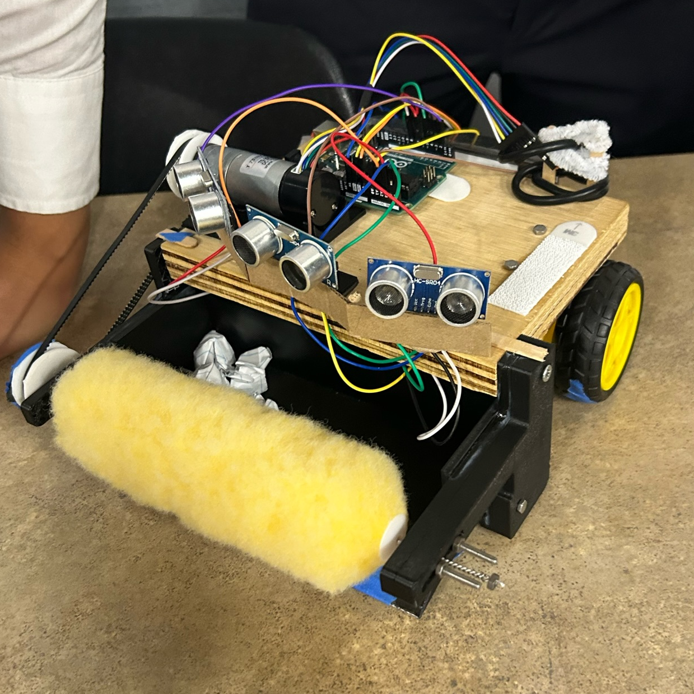

# FUSION-Roomba

## Objective

To design and manufacture an autonomous robot capable of picking up small amounts of dirt and debris from the ground simultaneously avoiding any obstacles in the way.
Competition:
Each team will begin with their robot in a square 5 by 5 feet field with small pieces of dirt and obstacles randomly scattered around. The objective for the robot is to pick up the pieces of dirt while simultaneously avoiding the obstacles present in the way. Each team will be scored based on their performance during the 2 minute period. Each piece of ‘dirt’ picked up by the robot is +1 point and each time the robot hits an obstacle is -1 point. The final score in the end will represent the team’s score and will be used to determine the winner. 

## Write up
[Final Report](https://docs.google.com/document/d/e/2PACX-1vQUEa-je6jN69eUCvxmIlLJOOaWOhVm2kjPrkbjGfb1Dl7WIwcin91HxsYEKMYJKEB4g44YKOibjgzP/pub 'Final Report')

[Website](https://projects.eng.uci.edu/projects/2022-2023/fusion-engineering-project-autonomous-vacuum-team-swiffer-diss-track)
## Pictures

 
## How to use / Tutorial (Software)

1. Zip the 'libraries' folder
2. Open ArduinoIDE with the rumba_demo.ino
3. Go to nav bar: Sketch > Include Library > Add .ZIP Library > "libraries.zip"
4. Verify and Upload rumba_demo to the arduino board

## Quick Links
- https://maker.pro/arduino/tutorial/using-unit-test-frameworks-with-arduino

